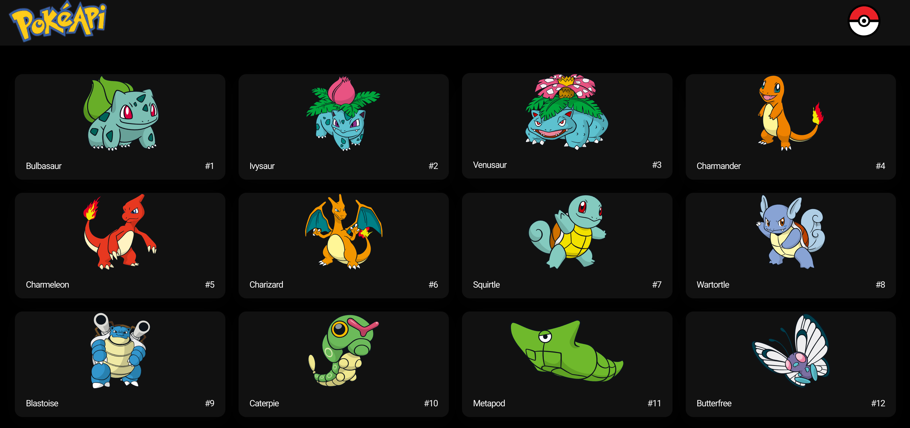
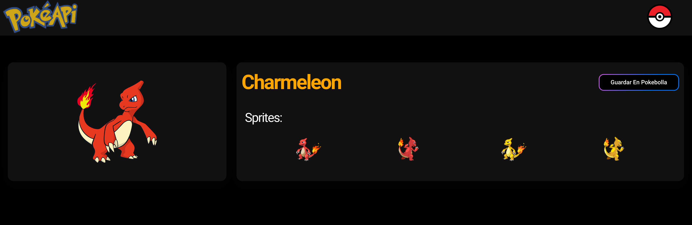
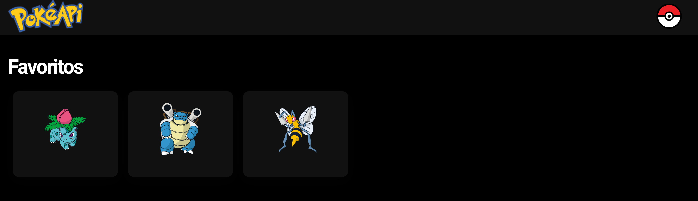
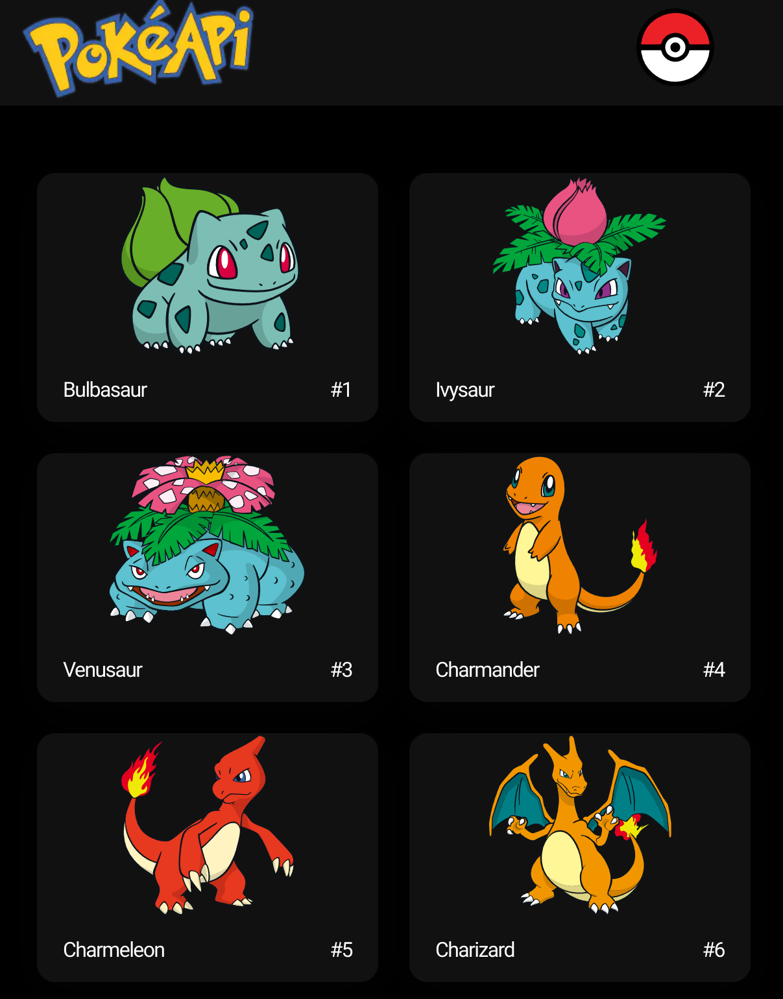

&nbsp;

&nbsp;

# Aplicación Next.Js - Pokemon API Static

Creacion de proyecto de tarjetas de personajes **POKEMON** con uso del API `PokeAPI` , en el cual se ponen en practica tecnicas de construccion estaticas del lado del servidor como: `Incremental Static Generation (ISG)` e `Incremental Static Regeneration (ISR)`.  Asi como tambien se pusieron en practica los siguientes principios:

Elaborado en Next.Js `v12.3.4`, React `v17.0.2`, NextUI `v1.0.2-beta.2`, carga de datos desde API externa `PokeAPI`.

**pokeapi-static**
[DEMO](https://rgomez-next-pokeapi-ssg.vercel.app/)

**pokeapi-incremental-static**
[DEMO](https://rgomez-next-pokeapi-incremental-static.vercel.app/)

&nbsp;

## Screenshots del proyecto

## Descripción del proyecto

&nbsp;

**1) Propiedades y funciones de Next,js**
   - Control general del documento mendiante el archivo `_document.tsx` con la propiedad `DocumentContext`

   - Ejecucion del lado del servidor `getStaticProps` ,`getStaticPaths`,

   - Uso de propiedades de componentes `FC`, `<NextPage>`, `<Image>`, `<Html>`, `<Head>`, `<Main>`, `<NextScript>`

  - Creacion de paginas dinamicas `[id]`

  - Uso de variables de entorno `.env`
    
  - Manejo de tipado `interface`, `type`

&nbsp; 

**2) Propiedades y funciones de React JS**
- Propiedades de React JS: `useEffect`,  `useState`, `useRouter`.

&nbsp; 

**3) Actividades y acciones atraves de API**
- Manejo de libreria de conexion API con `axios`
  
- Creacion de CRUD con `API Rest Full` de Next.js

&nbsp; 

**4) Librerias externas y de componentes**

- Uso de librerias externas `canvas-confetti`

- Uso de componentes Next/UI `<Row>`, `<Text>`, `<Image>`, `<Button>`, `<Container>`, `<Spacer>`, `<Link>`, `<Card>, <Card.Body>, <Card.Header>`, `<Grid>`, `<createTheme>`

- Uso de `drag and drop`

&nbsp; 

&nbsp; 

## Como levantar proyecto
    npm run dev    (modo desarrollo)
    npm run start  (despues de hacer build)

&nbsp; 

## Exportar proyecto - Build
Ejecute el comando `npm run build` para exportar el proyecto. Al exportar el proyecto se almacenarán en el directorio `.next`.

    npm run build

